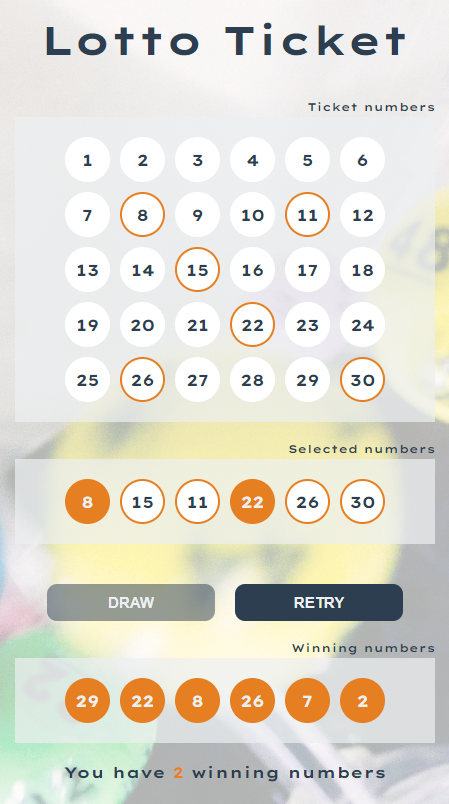

This application simulates the experience of a lottery game.

## Table of contents

- [Overview](#overview)
  - [The challenge](#the-challenge)
  - [Screenshot](#screenshot)
  - [Links](#links)
- [My process](#my-process)
  - [Built with](#built-with)
  - [What I Learned](#what-i-learned)
- [Author](#author)

## Overview

### The challenge

- Create a list of ticket numbers from 1 to 30 that can be selected
- When numbers are selected, display them in a selected numbers list
- Delete the number from selected list when click on them
- Only if 6 numbers are selected the Draw button becomes active
- When the Draw button is pressed spin the random numbers from winning numbers list
- After spin is done highlight the winning numbers and hide the Draw button
- Retry button becomes active and if pressed resets the game

### Screenshot

### Links

- Solution URL: [GitHub](https://github.com/andre1dragos/lotto_game.git)
- Live Site URL: [Live](https://andre1dragos.github.io/lotto_game/)

### Built with

- Semantic HTML5 markup
- CSS best practices
- Modern Javascript
- Dry principle

### What I learned

- Working with array methods

## Author

- GitHub - [Dragos Andrei](https://github.com/andre1dragos)
